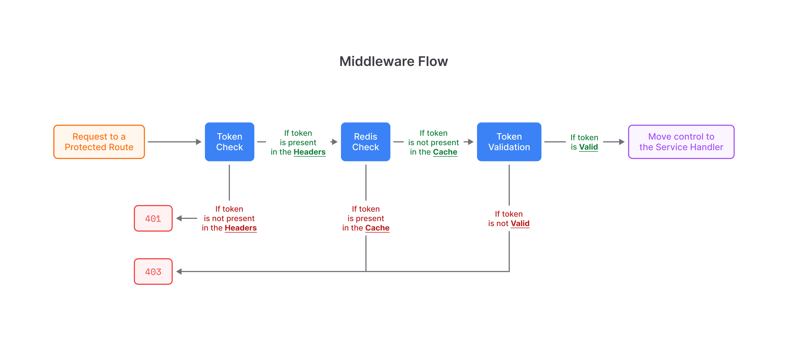

# Auth Documentation

Basic authentication API flow with JWT tokens (access + refresh) and token black-listing with Node.js, Express.js, TypeScript, Prisma, MongoDB and Redis.

## Libraries Used

- **Prisma:** MongoDB ORM
- **Bcrypt:** Hashing passwords before storing in the DB
- **Express:** Framework
- **HTTP Errors:** Handling HTTP errors
- **JWT:** Tokenisation
- **Morgan:** Logging tool
- **Redis:** Maintaining the list of black-listed tokens

## Environmental Variables

- `DATABASE_URL`: MongoDB instance
- `JWT_ACCESS_KEY`: For encrypting and decrypting access tokens
- `JWT_REFRESH_KEY`: For encrypting and decrypting refresh tokens
- `REDIS_HOST`: Redis DB instance

## Endpoints

Some of the endpoints are protected with a middleware, which is explained in the following section. Please make note of the following points while working with the endpoints:

- If authorization tokens are not present, **401** will be thrown as an error.
- If authorization tokens are not valid - expired, invalid or black-listed, **403** will be thrown as an error.
- If there is a missing payload, **400** will be thrown as an error.

Below is the list of all the endpoints:

| Method + Route        | Description                       | Headers                               | Payload         |
| --------------------- | --------------------------------- | ------------------------------------- | --------------- |
| GET - /               | Test the server status            | -                                     | -               |
| POST - /login         | Login a user                      | -                                     | email, password |
| POST - /register      | Register a new user               | -                                     | name, email, id |
| GET - /logout         | Logout from a session             | auth-token-access, auth-token-refresh | -               |
| GET - /refresh-tokens | Get new tokens (refresh + access) | authorization (refresh token)         | -               |
| POST - /user/details  | Get user details                  | authorization (access token)          | -               |

## Middleware flow

There is only one middleware which is applied on protected routes to validate the tokens. This is a normal middleware but a **string value of the token secret** is passed as an argument along with the default arguments (request, response and next). This is done to make the middleware know which type of token is being validated.

This middleware also **attaches the decoded payload in the locals** so that it can be used by the next middleware or service handler.

The function of the middleware is to check the tokens, validate with the Redis DB and validate the tokens. Explanation is given below:

1. Check whether the **tokens are present** in the headers:
   - If the tokens are present continue.
   - If the tokens are not present, throw **401** error.
2. Check for **black-listed tokens in the Redis DB and compare** with the tokens in the headers:
   - If the token is not present in the Redis DB, this means that the token is not black-listed, so, continue. A token is black-listed when it is not in use due to a refresh or a user but it is still not expired.
   - If the token is present in the the Redis DB, this means that the token is black-listed, so, throw **403** error. This is added because there can be cases where the **user is logged out but the token is still not expired** and someone gets the access to the token and uses it. In this case the tokens which are **not expired** but are **not in use because of a refresh or user logout** are stored as **Redis keys** with an **expiration**. The Redis expiration is same as the JWT expiration.
3. **Validate** the token:
   - If the token is valid, continue and hand over the flow to the service handler or the next middleware (if any).
   - If the token is not valid, throw **403** error.

Step 2 and 3 can be switched, the decision is a subjective. Right now they are executed one-by-one, but they can also be executed side-by-side to save time.

## Usage and Integration

There are a lot ways to integrate it with the frontend. You can clone and add new features and improve the flow based on your needs as well. The following way is suggested for the current flow:

- Create an **Axios instance** with the required configuration.
- Store the **tokens in a cookie with expiration** time.
- Add a **request interceptor on the Axios instance** to check for the **missing access token**. This is done to see whether a refresh is required. If the access token is missing, request for a new access token and continue with the request. If the access token is there in the cookies, continue with the request.
- **Make sure to clear the tokens** from the cookies on logout.
- Make sure to delete the previous tokens (both) and store the new ones on refresh.
